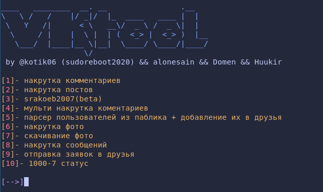

# VKTOOL





## УСТАНОВКА:

### Termux

```bash
# Устанавливаем системные зависимости
pkg install git python3 python3-pip -y

# Скачиваем репозиторий
git clone https://github.com/kotik06/VKTOOL
# Установка питонячих библиотек + добавление алиаса в .bashrc, .zshrc
cd VKTOOL && python main.py install
```

### Ubuntu/Debian

```bash
# Устанавливаем системные зависимости
sudo apt install git python3 python3-pip -y

# Скачиваем репозиторий
git clone https://github.com/kotik06/VKTOOL
```

### Arch Linux

```bash
# Устанавливаем системные зависимости
sudo pacman -Sy git 
sudo pacman -Sy python
sudo pacman -Sy python-pip
# Скачиваем репозиторий
git clone https://github.com/kotik06/VKTOOL
```
# Установка питонячих библиотек + добавление алиаса в .bashrc, .zshrc
```zsh
cd VKTOOL && python main.py install
``` 
## Запуск
```bash
#Запуск обычноый версии
vktool-cli full 

#Запуск лайт версии
vktool-cli light
```

## Обновления
```bash
vktool-cli update
```
# Внимание:  в бете! 
